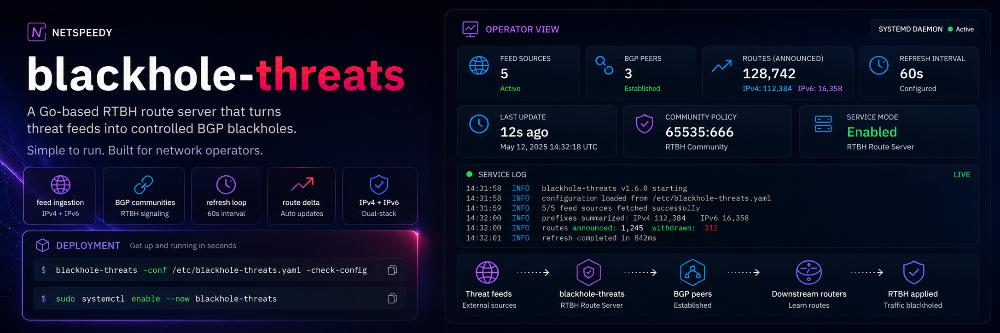

<p align="center">
  
</p>

<p align="center">
  <a href="https://github.com/netspeedy/blackhole-threats/actions/workflows/build-and-validate.yml"></a>
  <a href="https://github.com/netspeedy/blackhole-threats/actions/workflows/container-image.yml"></a>
  <a href="https://github.com/netspeedy/blackhole-threats/releases"></a>
  <a href="https://netspeedy.github.io/blackhole-threats/"></a>
  <a href="https://ghcr.io/netspeedy/blackhole-threats"></a>
  <a href="https://go.dev/"></a>
  <a href="LICENSE"></a>
  <a href="https://buymeacoffee.com/soakes"></a>
</p>

---

`blackhole-threats` turns local or remote threat feeds into controlled RTBH BGP
announcements. It is built for operators who want a small, auditable service
with one YAML configuration format, conservative route reconciliation, and
first-party delivery through source builds, container images, Debian packages,
and a signed APT repository.

**Quick links:** [Releases](https://github.com/netspeedy/blackhole-threats/releases) · [GHCR](https://ghcr.io/netspeedy/blackhole-threats) · [APT Repository](https://netspeedy.github.io/blackhole-threats/) · [Documentation](docs/README.md) · [Architecture](docs/architecture.md) · [Operations](docs/operations.md) · [Discussions](https://github.com/netspeedy/blackhole-threats/discussions) · [Contributing](CONTRIBUTING.md)

## What It Does

The daemon reads configured threat feeds, extracts IPv4 and IPv6 prefixes,
summarises overlapping networks, and advertises the resulting routes to BGP
peers so downstream routers can apply blackhole policy.

In production terms, it provides:

- **Feed ingestion** from local files, `http://`, and `https://` sources
- **Format handling** for plain text, JSON, JSONL, and NDJSON feeds
- **IPv4 and IPv6 route support** with prefix summarisation before publication
- **BGP community control** per feed, with a default of `<local ASN>:666`
- **Conservative refresh behavior** that keeps the last good community state
  when one of that community's feeds fails
- **Operator controls** for config validation, one-shot runs, log formatting,
  refresh intervals, and immediate `SIGUSR1` refreshes
- **First-party distribution** through release binaries, GHCR images, Debian
  packages, and a signed APT repository

## Why Operators Use It

`blackhole-threats` is intentionally boring infrastructure. The routing model is
easy to inspect: every refresh builds the desired route table, compares it with
currently advertised state, withdraws stale routes, and announces only routes
that are new or changed.

That gives operators three useful safety properties:

- Failed input does not automatically flush previously good routes for that
  BGP community.
- Route churn stays lower than replaying the full table every refresh.
- Deployment artifacts are produced in the open from the same repository as the
  runtime, packaging, docs, and release automation.

The original `blackhole-threats` project by Eric Barkie established the
GoBGP-based pattern for advertising threat-feed routes. This repository carries
that operational model forward with current Go toolchains, package publishing,
container images, and automated release validation.

Credit for the original project and idea belongs to Eric Barkie:
[`ebarkie/blackhole-threats`](https://github.com/ebarkie/blackhole-threats),
originally published as `Blackhole threats (with GoBGP)`.

## Deployment Paths

### Signed APT Repository

For Debian-family hosts, the signed APT repository is the recommended production
path. It installs the binary, systemd unit, default environment file, man page,
sample config, and packaged documentation in conventional locations.

```bash
sudo install -d -m 0755 /etc/apt/keyrings
curl -fsSL https://netspeedy.github.io/blackhole-threats/blackhole-threats-archive-keyring.gpg \
  | sudo tee /etc/apt/keyrings/blackhole-threats-archive-keyring.gpg >/dev/null

curl -fsSL https://netspeedy.github.io/blackhole-threats/blackhole-threats-archive-keyring.fingerprint.txt

# Verify the fingerprint matches the expected archive key before proceeding.

sudo tee /etc/apt/sources.list.d/blackhole-threats.sources >/dev/null <<'EOF'
Types: deb deb-src
URIs: https://netspeedy.github.io/blackhole-threats/
Suites: stable
Components: main
Signed-By: /etc/apt/keyrings/blackhole-threats-archive-keyring.gpg
EOF

sudo apt update
sudo apt install blackhole-threats
```

Useful package commands:

```bash
sudo /usr/sbin/blackhole-threats -conf /etc/blackhole-threats.yaml -check-config
sudo systemctl enable --now blackhole-threats
sudo systemctl reload blackhole-threats
sudo journalctl -u blackhole-threats -f
```

The APT repository includes binary and source indexes, signed metadata, the
archive key, and a published fingerprint for out-of-band verification. See
[Deployment Examples](docs/deployment-examples.md) for the full Debian path.

### Container Image

The container image is published to GitHub Container Registry:

```bash
docker pull ghcr.io/netspeedy/blackhole-threats:latest
docker run -d \
  -p 179:179 \
  -v "$PWD/config:/config" \
  --name blackhole-threats \
  ghcr.io/netspeedy/blackhole-threats:latest
```

`latest` tracks stable tagged releases. Release candidates publish to `rc` and
their full `v*-rc.*` tag. The image uses a Debian Trixie runtime base, S6
Overlay supervision, structured stdout logs, and `/config` for runtime
configuration.

### Source Build

Source builds use the local Go toolchain and the repo `Makefile`:

```bash
git clone https://github.com/netspeedy/blackhole-threats.git
cd blackhole-threats
make build
./dist/blackhole-threats -conf examples/blackhole-threats.yaml -check-config
```

`go.mod` defines the minimum supported source-build version. CI and container
builder images may track the current stable Go release separately.

## First Deployment Checklist

1. Copy [`examples/blackhole-threats.yaml`](examples/blackhole-threats.yaml) to
   your deployment path.
2. Replace the local ASN, router ID, neighbors, feed URLs, and BGP communities
   with values for your network.
3. Validate the file with `-check-config` before starting GoBGP.
4. Run `-once` against a lab or unprivileged local BGP port before binding to
   production port `179`.
5. Confirm startup logs show the expected `tag_version`, `local_as`,
   `router_id`, `peer_count`, and `default_community` fields.
6. Enable the long-running service only after the one-shot validation path looks
   correct.

The [Operations Guide](docs/operations.md) covers validation modes, service
startup, runtime controls, manual refreshes, configuration changes, and day-2
operational patterns.

## Configuration Preview

The service uses a YAML file with two top-level sections:

- `gobgp`: the GoBGP configuration set
- `feeds`: local or remote threat intelligence sources

Minimal example:

```yaml
gobgp:
  global:
    config:
      as: 64520
      routerid: "198.51.100.10"
      port: 1179
  neighbors:
    - config:
        neighboraddress: "198.51.100.1"
        peeras: 64520
        port: 1179

feeds:
  - url: https://team-cymru.org/Services/Bogons/fullbogons-ipv4.txt
    community: 64520:1101
```

Important notes:

- Omit `community` to use the default `<local ASN>:666` community.
- Communities must be written as `<as>:<action>` with each component in the
  range `0-65535`.
- Local file paths are valid feed URLs.
- Omitted BGP ports use standard port `179`.
- The router ID must be IPv4, even when peers include IPv6 neighbors.
- The sample addresses use documentation ranges; replace them before deployment.

See the [Configuration Reference](docs/config-reference.md) for the complete
schema and [`examples/blackhole-threats.yaml`](examples/blackhole-threats.yaml)
for the fuller operator example.

## Runtime Controls

Common commands:

```bash
./dist/blackhole-threats -conf /path/to/blackhole-threats.yaml -check-config
./dist/blackhole-threats -conf /path/to/blackhole-threats.yaml -once
./dist/blackhole-threats -conf /path/to/blackhole-threats.yaml -log-format json -log-level info
kill -USR1 <pid>
```

Packaged installations expose the same refresh path through systemd:

```bash
sudo systemctl reload blackhole-threats
```

`SIGUSR1` and `systemctl reload` trigger an immediate feed refresh and route
reconciliation. They do not reload YAML or command-line flags; restart the
process after configuration changes.

Logs are structured by default in a logfmt-style format suitable for Docker,
journald, syslog, and log shipping pipelines. Use `-log-format json` for
newline-delimited JSON.

## Feed Behavior

Supported sources:

- Local files with no URI scheme
- `http://` endpoints
- `https://` endpoints

Supported formats:

- Plain text prefix lists
- JSON arrays
- JSONL
- NDJSON

The parser ignores common comment styles in text feeds, extracts embedded IPv4
and IPv6 prefixes, and treats individual IP addresses as host prefixes. JSON
feeds are scanned for common fields such as `cidr`, `prefix`, `ip`, and
`address`.

See [Feed Behavior](docs/feed-behavior.md) for parsing, grouping, summarisation,
and failure semantics.

## Documentation

Longer-form docs live under [`docs/`](docs/README.md):

| Document | Use it for |
| --- | --- |
| [Operations Guide](docs/operations.md) | First deployment, runtime controls, day-2 changes |
| [Configuration Reference](docs/config-reference.md) | YAML shape, validation rules, CLI interaction |
| [Deployment Examples](docs/deployment-examples.md) | Source, Debian, container, local feed, and router policy examples |
| [Feed Behavior](docs/feed-behavior.md) | Feed parsing, grouping, summarisation, failure handling |
| [Architecture](docs/architecture.md) | Package boundaries, runtime lifecycle, design goals |
| [Release and Publishing](docs/release-and-publishing.md) | Release candidates, stable promotion, APT, GHCR, assets |
| [Troubleshooting](docs/troubleshooting.md) | Config, feed, BGP, container, service, and publish issues |

## Release and Supply Chain

The project treats release artifacts as operator-facing deliverables:

- Linux runtime tarballs are published for `amd64`, `arm64`, and `arm`.
- GHCR images are published for trusted release tags and recovery dispatches.
- Debian binary packages are published for `amd64`, `arm64`, and `armhf`.
- Debian source package artifacts and `deb-src` indexes are published for
  stable releases.
- GitHub Releases carry curated operator assets and checksums, not maintainer
  byproducts such as dbgsym, buildinfo, or changes files.
- Stable releases publish signed APT metadata through GitHub Pages.

`main` is kept release-candidate-ready. Stable promotion is an explicit
maintainer step after the release candidate path has validated.

## Contributing and Support

Contributions should preserve the operator-facing behavior of the project:

- keep route behavior easy to understand
- preserve packaging and release reproducibility
- avoid undocumented surprises in BGP policy or install paths
- keep README, packaging, workflows, and docs aligned when behavior changes

Local validation for code changes:

```bash
make fmt-check
make vet
make test
make build
```

Use the full [Contributing Guide](CONTRIBUTING.md) for pull request expectations,
release-note labels, validation scope, and public-repo workflow safety.

Project health and support files:

- [LICENSE](LICENSE)
- [SECURITY.md](SECURITY.md)
- [SUPPORT.md](SUPPORT.md)
- [CODE_OF_CONDUCT.md](CODE_OF_CONDUCT.md)
- [GOVERNANCE.md](GOVERNANCE.md)
- [ROADMAP.md](ROADMAP.md)
- [FUNDING.md](FUNDING.md)
- [OPEN_SOURCE_IMPACT.md](OPEN_SOURCE_IMPACT.md)

Operator questions, deployment notes, feed ideas, and roadmap discussion are
welcome in [GitHub Discussions](https://github.com/netspeedy/blackhole-threats/discussions).

## License

This project is licensed under the MIT License. See [LICENSE](LICENSE).
