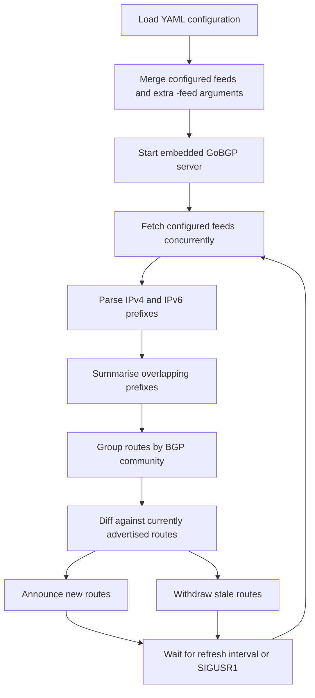

# blackhole-threats

[](https://github.com/soakes/blackhole-threats/actions/workflows/build-and-validate.yml)
[](https://github.com/soakes/blackhole-threats/actions/workflows/container-image.yml)
[](https://github.com/soakes/blackhole-threats/releases)
[](https://go.dev/)
[](LICENSE)
[](https://github.com/osrg/gobgp)
[](https://ghcr.io/soakes/blackhole-threats)
[](debian/)
[](https://buymeacoffee.com/soakes)
[](.github/dependabot.yml)

## Table of Contents

- [Overview](#overview)
- [Capabilities](#capabilities)
- [How It Works](#how-it-works)
- [Prerequisites](#prerequisites)
- [Installation](#installation)
- [Configuration](#configuration)
- [Feed Sources and Formats](#feed-sources-and-formats)
- [Usage](#usage)
- [Container](#container)
- [Debian Package](#debian-package)
- [APT Repository](#apt-repository)
- [CI/CD and Release Automation](#cicd-and-release-automation)
- [Project Structure](#project-structure)
- [Troubleshooting](#troubleshooting)
- [Contributing](#contributing)
- [License](#license)

---

## Overview

`blackhole-threats` is a Go RTBH route server. It reads local or remote threat
feeds, extracts IPv4 and IPv6 networks, summarises them, and advertises the
resulting routes over BGP so downstream routers can apply blackhole policy.

In normal operation the service does four things:

- loads GoBGP and feed configuration from YAML
- fetches and parses the configured feeds
- computes the route delta against the current advertised set
- announces new routes and withdraws stale ones on a refresh loop

This repository packages that workflow as a single service with first-party
source builds, container images, Debian packages, and a signed APT repository.

### Motivation and Lineage

The original `blackhole-threats` project by Eric Barkie established the basic
GoBGP-based pattern for advertising threat-feed routes. That repository was
archived on March 31, 2026. This repository continues the same operational
model with current Go toolchains, Debian packaging, container publishing,
GitHub Actions workflows, and automated pin refreshes.

Credit for the original project and idea belongs to Eric Barkie:

- Original repository: <https://github.com/ebarkie/blackhole-threats>
- Original project title: `Blackhole threats (with GoBGP)`

---

## Capabilities

- YAML configuration for GoBGP settings and feed definitions
- Built-in configuration validation via `-check-config`
- Feed inputs from local files, `http://`, and `https://` sources
- Plain text, JSON, JSONL, and NDJSON parsing
- IPv4 and IPv6 prefix extraction and summarisation
- Per-feed BGP community assignment, defaulting to `<local ASN>:666`
- Periodic refresh with manual refresh support via `SIGUSR1`
- One-shot runtime mode via `-once` for smoke tests and operator checks
- Conservative refresh handling that keeps the last good community state when a
  feed refresh fails
- Release binaries for `linux/amd64`, `linux/arm64`, and `linux/arm`
- Published container images for `linux/amd64` and `linux/arm64`
- Debian packaging with systemd integration
- GitHub Actions workflows for validation, release publishing, and pin refresh

---

## How It Works

At runtime, `blackhole-threats` follows a simple route lifecycle:



If a feed refresh fails for a community, the daemon keeps the last good routes
for that community and retries on the next refresh instead of withdrawing on
partial input.

1. Load YAML configuration from `blackhole-threats.yaml` or the configured path.
2. Merge configured feeds with any additional `-feed` CLI arguments.
3. Start the embedded GoBGP server.
4. Fetch all configured feeds concurrently.
5. Parse IPv4 and IPv6 prefixes from each source.
6. Summarise overlapping prefixes to reduce route churn.
7. Group routes by BGP community.
8. Diff the new route set against the current route set.
9. Announce new routes and withdraw stale ones.
10. Repeat on the configured refresh interval, or immediately when sent `SIGUSR1`.

For the package layout and component boundaries, see
[docs/architecture.md](docs/architecture.md).

---

## Prerequisites

- A BGP-speaking environment where downstream routers can peer with this service
- A valid GoBGP-compatible configuration for your local ASN, router ID, and peers
- One or more threat feeds reachable as:
  - local files
  - `http://` URLs
  - `https://` URLs
- Go `1.24+` if building from source
- Docker if running the container image
- Debian packaging tools if building `.deb` packages locally

---

## Installation

### Build From Source

```bash
git clone https://github.com/soakes/blackhole-threats.git
cd blackhole-threats
make build
```

This produces:

```text
dist/blackhole-threats
```

The minimum supported Go version stays aligned with Debian trixie packaging.
GitHub Actions and container builds track the current stable Go release
separately.

### Run the Published Container

```bash
docker pull ghcr.io/soakes/blackhole-threats:latest
```

### Build a Debian Package

```bash
make package
```

This expects Debian packaging tools such as `debhelper`, `golang-any`, and
`devscripts` to be available.

---

## Configuration

The service uses a YAML file with two main sections:

- `gobgp`: the GoBGP configuration set
- `feeds`: the threat intelligence sources to ingest

A ready-to-edit reference file lives at
[`examples/blackhole-threats.yaml`](examples/blackhole-threats.yaml).

### Example Configuration

```yaml
gobgp:
  global:
    config:
      as: 64512
      routerid: "192.168.1.1"
  neighbors:
    - config:
        neighboraddress: "192.168.1.1"
        peeras: 64512

feeds:
  - url: https://www.spamhaus.org/drop/drop.txt
  - url: https://rules.emergingthreats.net/fwrules/emerging-Block-IPs.txt
    community: 64512:777
```

### Configuration Notes

- If `community` is omitted, the service defaults it to `<local ASN>:666`
- Communities must be written as `<as>:<action>`
- Each community component must fit in the range `0-65535`
- Local file paths are supported as feed URLs
- The refresh timer defaults to `2h`

### RouterOS Examples

RouterOS filter examples are included below as starting points. Adjust ASN,
addresses, and policy to match your network.

#### RouterOS v6

```text
/routing bgp instance
set default as=64512
/routing bgp peer
add address-families=ip,ipv6 allow-as-in=2 in-filter=threats-in name=threats remote-address=\
    192.168.1.2 ttl=default
/routing filter
add action=accept address-family=ip bgp-communities=64512:666 chain=threats-in comment=\
    "Blackhole IPv4 C&C and don't route or peer addresses" protocol=bgp set-type=blackhole
add address-family=ipv6 bgp-communities=64512:666 chain=threats-in comment=\
    "Unreachable IPv6 C&C and don't route or peer addresses" protocol=bgp set-type=unreachable
```

#### RouterOS v7

```text
/routing bgp template
set default as=64512 disabled=no routing-table=main
/routing bgp connection
add address-families=ip,ipv6 as=64512 disabled=no input.allow-as=2 .filter=threats-in local.role=ibgp \
    name=threats remote.address=192.168.1.2 routing-table=main templates=default
/routing filter rule
add chain=threats-in comment="Blackhole C&C and don't route or peer addresses" disabled=no rule=\
    "if (bgp-communities equal 64512:666) {set blackhole yes; accept}"
```

---

## Feed Sources and Formats

`blackhole-threats` can ingest feeds from both disk and the network.

### Supported Sources

- Local files with no URI scheme
- `http://` endpoints
- `https://` endpoints

### Supported Formats

- Plain text prefix lists
- JSON
- JSONL
- NDJSON

### Text Feed Parsing

For plain text feeds, the parser:

- ignores empty lines
- ignores comment lines starting with `#`, `;`, or `//`
- extracts prefixes or individual IPs from mixed-content lines
- accepts both IPv4 and IPv6 entries

### JSON Feed Parsing

For JSON-derived feeds, the parser looks for common fields such as:

- `cidr`
- `prefix`
- `ip`
- `address`

Individual IP addresses are converted to host prefixes automatically.

Top-level JSON arrays and line-delimited JSON streams are both supported.

### Example Public Feeds

- [abuse.ch Botnet C2 IP Blacklist](https://sslbl.abuse.ch/blacklist/sslipblacklist.txt)
- [blocklist.de fail2ban reporting service](https://lists.blocklist.de/lists/all.txt)
- [Emerging Threats fwip rules](https://rules.emergingthreats.net/fwrules/emerging-Block-IPs.txt)
- [Spamhaus DROP](https://www.spamhaus.org/drop/drop.txt)
- [Spamhaus EDROP](https://www.spamhaus.org/drop/edrop.txt)
- [Talos IP Blacklist](https://www.talosintelligence.com/documents/ip-blacklist)

---

## Usage

### Basic Run

```bash
./dist/blackhole-threats -conf examples/blackhole-threats.yaml -debug
```

### Command-Line Flags

```text
-conf string
    Configuration file (default "blackhole-threats.yaml")
-check-config
    Validate configuration and exit
-debug
    Enable debug logging
-feed value
    Threat intelligence feed (use multiple times)
-once
    Run a single refresh cycle and exit
-refresh-rate duration
    Refresh timer (default 2h0m0s)
-version
    Print version information and exit
```

### Common Examples

Run with the default config path:

```bash
./dist/blackhole-threats
```

Run with a custom config file:

```bash
./dist/blackhole-threats -conf /etc/blackhole-threats.yaml
```

Validate configuration and exit without starting BGP:

```bash
./dist/blackhole-threats -conf examples/blackhole-threats.yaml -check-config
```

Run a single refresh cycle and exit:

```bash
./dist/blackhole-threats -conf examples/blackhole-threats.yaml -once
```

For unprivileged smoke tests, use a temporary config with
`gobgp.global.config.port` set to a high port such as `1179`.

Add an extra feed without editing the YAML file:

```bash
./dist/blackhole-threats \
  -conf examples/blackhole-threats.yaml \
  -feed https://www.spamhaus.org/drop/drop.txt
```

Use a faster refresh interval while testing:

```bash
./dist/blackhole-threats \
  -conf examples/blackhole-threats.yaml \
  -refresh-rate 15m \
  -debug
```

Trigger an immediate refresh on a running process:

```bash
kill -USR1 <pid>
```

On packaged installations, the same refresh can be triggered with:

```bash
sudo systemctl reload blackhole-threats
```

Print build metadata:

```bash
./dist/blackhole-threats -version
```

### Maintainer Commands

```bash
make fmt
make fmt-check
make vet
make test
make build
make docker-build
make package
```

---

## Container

The container image is published to GitHub Container Registry as:

```text
ghcr.io/soakes/blackhole-threats
```

### Container Notes

- Debian Trixie runtime base
- Current stable Go build stage on Debian Trixie
- S6 Overlay for supervision and lifecycle handling
- Pinned S6 Overlay release with checksum verification during image build
- Runtime configuration stored under `/config`
- Automatic first-boot creation of `/config/blackhole-threats.yaml`
- Optional container overrides:
  - `BLACKHOLE_THREATS_CONF` to point at a different config path
  - `BLACKHOLE_THREATS_EXTRA_OPTS` to append daemon flags such as `-debug`
- Multi-architecture images for `linux/amd64` and `linux/arm64`

### Example Usage

```bash
docker pull ghcr.io/soakes/blackhole-threats:latest
docker run -d \
  -p 179:179 \
  -v "$PWD/config:/config" \
  -e BLACKHOLE_THREATS_EXTRA_OPTS="-debug -refresh-rate 15m" \
  --name blackhole-threats \
  ghcr.io/soakes/blackhole-threats:latest
```

---

## Debian Package

The Debian package installs the service into standard Debian locations.

### Installed Paths

- Binary: `/usr/sbin/blackhole-threats`
- Default config: `/etc/blackhole-threats.yaml`
- Service defaults: `/etc/default/blackhole-threats`
- Manual page: `/usr/share/man/man8/blackhole-threats.8.gz`
- Sample config: `/usr/share/doc/blackhole-threats/examples/blackhole-threats.yaml`
- Additional packaged docs: `/usr/share/doc/blackhole-threats/`

### systemd Integration

The package ships a systemd unit and an `/etc/default/blackhole-threats`
environment file for native service management on Debian-family systems.

Command reference is available locally after installation with:

```bash
man blackhole-threats
```

Trigger an immediate feed refresh with:

```bash
sudo systemctl reload blackhole-threats
```

---

## APT Repository

Automated `v*` releases from `main` publish a signed APT repository through
GitHub Pages.

Repository base URL:

```text
https://soakes.github.io/blackhole-threats/
```

Archive key:

```text
https://soakes.github.io/blackhole-threats/blackhole-threats-archive-keyring.gpg
```

Archive key fingerprint:

```text
https://soakes.github.io/blackhole-threats/blackhole-threats-archive-keyring.fingerprint.txt
```

### Add the Repository

```bash
sudo install -d -m 0755 /etc/apt/keyrings
curl -fsSL https://soakes.github.io/blackhole-threats/blackhole-threats-archive-keyring.gpg \
  | sudo tee /etc/apt/keyrings/blackhole-threats-archive-keyring.gpg >/dev/null

curl -fsSL https://soakes.github.io/blackhole-threats/blackhole-threats-archive-keyring.fingerprint.txt

# Verify the fingerprint matches the expected archive key before proceeding

sudo tee /etc/apt/sources.list.d/blackhole-threats.sources >/dev/null <<'EOF'
Types: deb deb-src
URIs: https://soakes.github.io/blackhole-threats/
Suites: stable
Components: main
Signed-By: /etc/apt/keyrings/blackhole-threats-archive-keyring.gpg
EOF

sudo apt update
sudo apt install blackhole-threats
```

### Notes

- Binary indexes are published under `dists/stable/main/binary-*`
- Source indexes are published under `dists/stable/main/source`
- Repository metadata is signed and published as `InRelease` and `Release.gpg`
- The public archive key is published alongside the repository for `signed-by`
- The full archive key fingerprint is published alongside the repository for
  out-of-band verification
- Packages are hosted through GitHub Pages rather than the GitHub Releases asset listing
- Tagged GitHub Releases also attach the Debian source package files for offline
  retrieval and inspection
- GitHub Pages must be enabled for this repository with GitHub Actions as the
  publishing source
- The signing workflow should use protected environment secrets on the
  `apt-repository` environment:
  - `APT_GPG_PRIVATE_KEY`
  - `APT_GPG_KEY_ID` if the imported secret contains more than one signing key
  - `APT_GPG_PASSPHRASE` if the signing key is passphrase protected

---

## CI/CD and Release Automation

GitHub Actions covers validation, packaging, publishing, and scheduled pin
refresh for this repository.

### Workflows

- `Build and Validate`
  - runs formatting, vetting, tests, native build checks, binary smoke tests, Debian package validation, unsigned APT repository layout validation, and cross-build validation
- `Container Image`
  - validates the container build, smoke-tests bootstrap and config override behavior, validates published platforms, and publishes to GHCR
- `Automated Release Tag`
  - runs after `Build and Validate` succeeds for a push to `main`, calculates the next semantic `v*` tag from conventional commit history, creates the tag, and dispatches the publish workflows
- `Release Assets`
  - builds tagged release binaries plus Debian binary and source packages, generates checksums, writes release notes from commit history, and publishes GitHub Releases
- `Publish Signed Debian Repository`
  - builds Debian binary and source packages, generates APT metadata, smoke-tests the signed repository with APT, signs the repository, and deploys it to GitHub Pages
- `Refresh Build and Runtime Pins`
  - refreshes the pinned Docker Go build image version and updates the pinned Docker `s6-overlay` version and checksum pins

### Automated Updates

- Dependabot checks GitHub Actions, Go modules, and Docker base images daily
- The scheduled refresh workflow updates the pinned Docker Go build image
  version and the pinned Docker `s6-overlay` release metadata

### Public Repository Hardening

- Pull requests run validation jobs only; they do not run the signed repository
  publisher or release publisher
- `main` is treated as releaseable: each merge to `main` can become the next
  automated tagged release
- automated version bumps use `feat` for minor releases, `fix`/`perf`/`revert`/
  `container`/`build`/`deps`/`packaging` for patch releases, and
  `BREAKING CHANGE:` or `type!:` for major releases
- The signed Debian repository workflow only runs on `v*` tags that point to
  commits already contained in `main`
- The GitHub release workflow only runs on `v*` tags that point to commits
  already contained in `main`
- The GHCR publish job only runs on `main` pushes or `v*` tags that point to
  commits already contained in `main`
- Write permissions are scoped to the specific publish jobs that need them
- The scheduled dependency refresh job only runs from the default branch
- The archive signing key should be stored as a protected environment secret,
  not as a broadly scoped repository secret

---

## Project Structure

```text
blackhole-threats/
├── .github/
│   ├── dependabot.yml
│   └── workflows/
│       ├── automated-release.yml
│       ├── build-and-validate.yml
│       ├── container-image.yml
│       ├── publish-apt-repository.yml
│       ├── refresh-toolchain-and-runtime.yml
│       └── release-assets.yml
├── cmd/
│   └── blackhole-threats/
│       └── main.go
├── debian/
├── docs/
│   └── architecture.md
├── examples/
│   └── blackhole-threats.yaml
├── internal/
│   ├── bgp/
│   ├── buildinfo/
│   ├── config/
│   └── feed/
├── packaging/
│   └── container/
├── scripts/
│   └── build-apt-repository.sh
├── Dockerfile
├── Makefile
├── go.mod
└── README.md
```

### Key Directories

- `cmd/blackhole-threats`
  - CLI entrypoint, flag parsing, signal wiring, and process startup
- `internal/config`
  - YAML loading, feed definitions, and community parsing
- `internal/feed`
  - feed retrieval, parsing, and prefix summarisation
- `internal/bgp`
  - GoBGP lifecycle and route announce/withdraw logic
- `packaging/container`
  - container rootfs and S6 service definitions
- `debian`
  - Debian packaging metadata

---

## Troubleshooting

### Configuration File Not Found

Symptom:

```text
Failed to load configuration
```

Checks:

- confirm the `-conf` path exists
- verify the service user can read it
- make sure the container bind mount is present if using Docker

### Feed Parse Errors

Symptom:

```text
Failed to parse feed
```

Checks:

- verify the URL is reachable
- confirm local file paths are correct
- check for malformed JSON in JSON-derived feeds
- confirm the remote endpoint returns `200 OK`

### Routes Not Appearing

Checks:

- confirm the BGP session is established
- verify the configured router ID is correct
- check whether the selected community matches your router-side policy
- increase logging with `-debug`
- trigger a manual refresh with `SIGUSR1`
- use `systemctl reload blackhole-threats` on packaged installations

### Container Starts But No Config Appears

Checks:

- verify the `/config` directory is writable
- confirm the volume mount is present
- inspect container logs with `docker logs blackhole-threats`

### Debian Service Does Not Start

Checks:

- review `/etc/default/blackhole-threats`
- confirm `/etc/blackhole-threats.yaml` exists and is readable
- inspect `systemctl status blackhole-threats`
- inspect `journalctl -u blackhole-threats`

---

## Contributing

Contributions should preserve the operator-facing behavior of the project:

- keep runtime behavior easy to understand
- preserve packaging and release reproducibility
- avoid undocumented surprises in routing behavior
- keep `main` in a releasable state

### Local Validation

```bash
make fmt
make fmt-check
make vet
make test
make build
```

If you change container, packaging, or release logic, also check:

```bash
make docker-build
make package
```

### Pull Request Expectations

- use conventional commit subjects for merge commits and squashed PRs
- include a meaningful commit body when the change affects operators,
  packaging, release flow, or security posture
- assume merged `main` commits are eligible for automated tagging and release
- use a release-bearing type when the change should publish artifacts;
  `docs`, `ci`, `chore`, `test`, and `refactor` do not cut a release by
  default
- explain the operational reason for the change
- keep README, packaging, and workflow docs in sync with behavior
- include test coverage or a verification note when code paths change
- call out any routing, packaging, or upgrade impact explicitly
- do not broaden workflow permissions or secret exposure without a clear
  operational reason
- keep release and publishing workflows safe for a public repository

### Commit Message Guidance

Release notes are generated from commit history, so commit messages should be
written as release inputs rather than throwaway local notes.

Preferred shape:

```text
feat(container): restore startup banner and default config flow

Align the s6 runtime output with the documented container contract.
Restore the first-run config generation text and graceful shutdown banner.
Keep the image publish path suitable for automated release notes.
```

Practical rules:

- keep the subject in conventional commit form
- make the subject describe the visible outcome, not just the file touched
- use the body to explain operator impact, packaging changes, or security
  implications
- use `feat`, `fix`, `perf`, `revert`, `container`, `build`, `deps`, or
  `packaging` when the change should trigger an automated release
- use `BREAKING CHANGE:` in the body when the release should force a major
  version bump
- do not merge work to `main` unless you are happy for automation to tag and
  publish it

### Useful Contribution Areas

- additional operational documentation
- more feed examples and validation coverage
- router interoperability notes
- packaging and release polish
- dependency and supply-chain hardening

---

## License

This project is licensed under the MIT License. See [LICENSE](LICENSE).
