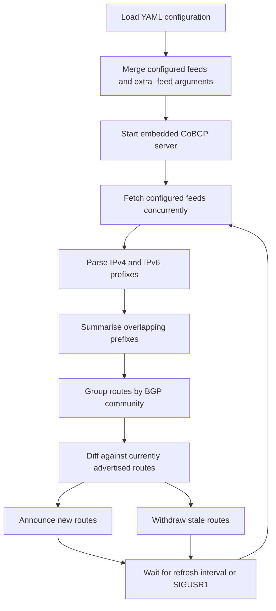

# 🛡️ Blackhole Threats

> A Go-based RTBH route server that turns threat feeds into controlled BGP blackhole announcements.

[](https://github.com/soakes/blackhole-threats/actions/workflows/build-and-validate.yml)
[](https://github.com/soakes/blackhole-threats/actions/workflows/container-image.yml)
[](https://github.com/soakes/blackhole-threats/releases)
[](https://soakes.github.io/blackhole-threats/)
[](https://ghcr.io/soakes/blackhole-threats)
[](https://go.dev/)
[](LICENSE)
[](https://buymeacoffee.com/soakes)

Built for operators who want one service, one config format, and one release path
they can actually deploy: source builds, container images, Debian packages,
and a signed APT repository.

**Quick links:** [📦 Releases](https://github.com/soakes/blackhole-threats/releases) · [🐳 GHCR](https://ghcr.io/soakes/blackhole-threats) · [🔐 APT Repository](https://soakes.github.io/blackhole-threats/) · [📚 Documentation](docs/README.md) · [🏗️ Architecture](docs/architecture.md)

## 🧭 Table of Contents

- [📖 Overview](#overview)
- [✨ Capabilities](#capabilities)
- [🔄 How It Works](#how-it-works)
- [✅ Prerequisites](#prerequisites)
- [🚀 Installation](#installation)
- [⚙️ Configuration](#configuration)
- [🌐 Feed Sources and Formats](#feed-sources-and-formats)
- [🧪 Usage](#usage)
- [🐳 Container](#container)
- [📦 Debian Package](#debian-package)
- [🔐 APT Repository](#apt-repository)
- [🤖 CI/CD and Release Automation](#cicd-and-release-automation)
- [🗂️ Project Structure](#project-structure)
- [🩺 Troubleshooting](#troubleshooting)
- [🤝 Contributing](#contributing)
- [📄 License](#license)

---

## 📖 Overview

`blackhole-threats` is a Go RTBH route server. It reads local or remote threat
feeds, extracts IPv4 and IPv6 networks, summarises them, and advertises the
resulting routes over BGP so downstream routers can apply blackhole policy.

In normal operation the service does four things:

- loads GoBGP and feed configuration from YAML
- fetches and parses the configured feeds
- computes the route delta against the current advertised set
- announces new routes and withdraws stale ones on a refresh loop

This repository packages that workflow as a single service with first-party
source builds, container images, Debian packages, and a signed APT repository.

### Quick Start

Pick the path that matches how you deploy:

- **Container**: pull `ghcr.io/soakes/blackhole-threats:latest` for the latest tagged release
- **Debian**: use the signed APT repository and install `blackhole-threats`
- **Source**: run `make build` and execute `dist/blackhole-threats`
- **Validation**: use `-check-config` or `-once` before putting the daemon into service

Longer-form guides for operations, configuration, release flow, and deployment
examples live under [`docs/`](docs/README.md).

### First Deployment Checklist

1. Copy [`examples/blackhole-threats.yaml`](examples/blackhole-threats.yaml) and replace the local ASN, router ID, peers, and feed communities for your network.
2. Validate the file with `./dist/blackhole-threats -conf /path/to/blackhole-threats.yaml -check-config`.
3. Use `-once` with an unprivileged local BGP port for a first smoke test before binding to production port `179`.
4. Start the daemon and inspect the startup logs for `tag_version`, `local_as`, `router_id`, `peer_count`, and the first `Refresh completed` line.
5. Only enable automatic service startup after the one-shot validation path looks correct.

### Motivation and Lineage

The original `blackhole-threats` project by Eric Barkie established the basic
GoBGP-based pattern for advertising threat-feed routes. That repository was
archived on March 31, 2026. This repository continues the same operational
model with current Go toolchains, Debian packaging, container publishing,
GitHub Actions workflows, and automated pin refreshes.

Credit for the original project and idea belongs to Eric Barkie:

- Original repository: <https://github.com/ebarkie/blackhole-threats>
- Original project title: `Blackhole threats (with GoBGP)`

---

## ✨ Capabilities

- **Feed ingestion**: reads local files plus `http://` and `https://` sources
- **Format handling**: parses plain text, JSON, JSONL, and NDJSON feeds
- **Prefix support**: extracts and summarises both IPv4 and IPv6 networks
- **Community control**: supports per-feed BGP communities and defaults to `<local ASN>:666`
- **Runtime control**: supports periodic refresh, `SIGUSR1`, `-check-config`, and `-once`
- **Failure handling**: keeps the last good community state when a feed refresh fails
- **Logging**: emits structured logfmt-style output for Docker, journald, and syslog pipelines
- **Distribution**: publishes release binaries, multi-arch container images, Debian packages, and a signed APT repository
- **Automation**: includes validation, release publishing, and pinned dependency refresh workflows

---

## 🔄 How It Works

At runtime, `blackhole-threats` follows a simple route lifecycle:



If a feed refresh fails for a community, the daemon keeps the last good routes
for that community and retries on the next refresh instead of withdrawing on
partial input.

1. Load YAML configuration from `blackhole-threats.yaml` or the configured path.
2. Merge configured feeds with any additional `-feed` CLI arguments.
3. Start the embedded GoBGP server.
4. Fetch all configured feeds concurrently.
5. Parse IPv4 and IPv6 prefixes from each source.
6. Summarise overlapping prefixes to reduce route churn.
7. Group routes by BGP community.
8. Diff the new route set against the current route set.
9. Announce new routes and withdraw stale ones.
10. Repeat on the configured refresh interval, or immediately when sent `SIGUSR1`.

For the package layout and component boundaries, see
[docs/architecture.md](docs/architecture.md).

---

## ✅ Prerequisites

- A BGP-speaking environment where downstream routers can peer with this service
- A valid GoBGP-compatible configuration for your local ASN, router ID, and peers
- One or more threat feeds reachable as:
  - local files
  - `http://` URLs
  - `https://` URLs
- Go `1.24+` if building from source
- Docker if running the container image
- Debian packaging tools if building `.deb` packages locally

---

## 🚀 Installation

### Build From Source

```bash
git clone https://github.com/soakes/blackhole-threats.git
cd blackhole-threats
make build
```

This produces:

```text
dist/blackhole-threats
```

The minimum supported Go version stays aligned with Debian trixie packaging.
GitHub Actions and container builds track the current stable Go release
separately.

### Run the Published Container

```bash
docker pull ghcr.io/soakes/blackhole-threats:latest
```

`latest` tracks stable tagged releases, and release candidates publish to the
`ghcr.io/soakes/blackhole-threats:rc` channel plus their full `v*-rc.*` tag.

### Build a Debian Package

```bash
make package
```

This expects Debian packaging tools such as `debhelper`, `golang-any`, and
`devscripts` to be available.

---

## ⚙️ Configuration

The service uses a YAML file with two main sections:

- `gobgp`: the GoBGP configuration set
- `feeds`: the threat intelligence sources to ingest

A ready-to-edit reference file lives at
[`examples/blackhole-threats.yaml`](examples/blackhole-threats.yaml).
That file is a full reference example with multiple peers, mixed IPv4/IPv6
neighbors, and a broader feed set. The shorter example below is the README
version to keep the page readable.

### Example Configuration

```yaml
gobgp:
  global:
    config:
      as: 64520
      routerid: "198.51.100.10"
  neighbors:
    - config:
        neighboraddress: "198.51.100.1"
        peeras: 64520
    - config:
        neighboraddress: "203.0.113.1"
        peeras: 64520
    - config:
        neighboraddress: "2001:db8:10::1"
        peeras: 64520
    - config:
        neighboraddress: "2001:db8:20::1"
        peeras: 64520

feeds:
  - url: http://localhost:41412/security/blocklist
    community: 64520:1100
  - url: https://team-cymru.org/Services/Bogons/fullbogons-ipv4.txt
    community: 64520:1101
  - url: https://team-cymru.org/Services/Bogons/fullbogons-ipv6.txt
    community: 64520:1101
  - url: https://www.spamhaus.org/drop/drop_v4.json
    community: 64520:1102
  - url: https://www.spamhaus.org/drop/drop_v6.json
    community: 64520:1103
  - url: https://rules.emergingthreats.net/fwrules/emerging-Block-IPs.txt
    community: 64520:1107
  - url: https://sslbl.abuse.ch/blacklist/sslipblacklist.txt
    community: 64520:1108
```

### Configuration Notes

- If `community` is omitted, the service defaults it to `<local ASN>:666`
- Communities must be written as `<as>:<action>`
- Each community component must fit in the range `0-65535`
- Local file paths are supported as feed URLs
- The refresh timer defaults to `2h`
- BGP port settings are optional; GoBGP uses standard port `179` when they are
  omitted
- `gobgp.global.config.port` optionally changes the local BGP listen port
- `gobgp.neighbors[].config.port` optionally changes the remote TCP port for a
  peer
- The sample config uses RFC 5737 IPv4 and RFC 3849 IPv6 documentation
  addresses; replace them with your real router ID and peer addresses

### RouterOS Examples

RouterOS filter examples are included below as starting points. Adjust ASN,
addresses, and policy to match your network.

#### RouterOS v6

```text
/routing bgp instance
set default as=64512
/routing bgp peer
add address-families=ip,ipv6 allow-as-in=2 in-filter=threats-in name=threats remote-address=\
    192.168.1.2 ttl=default
/routing filter
add action=accept address-family=ip bgp-communities=64512:666 chain=threats-in comment=\
    "Blackhole IPv4 C&C and don't route or peer addresses" protocol=bgp set-type=blackhole
add address-family=ipv6 bgp-communities=64512:666 chain=threats-in comment=\
    "Unreachable IPv6 C&C and don't route or peer addresses" protocol=bgp set-type=unreachable
```

#### RouterOS v7

```text
/routing bgp template
set default as=64512 disabled=no routing-table=main
/routing bgp connection
add address-families=ip,ipv6 as=64512 disabled=no input.allow-as=2 .filter=threats-in local.role=ibgp \
    name=threats remote.address=192.168.1.2 routing-table=main templates=default
/routing filter rule
add chain=threats-in comment="Blackhole C&C and don't route or peer addresses" disabled=no rule=\
    "if (bgp-communities equal 64512:666) {set blackhole yes; accept}"
```

---

## 🌐 Feed Sources and Formats

`blackhole-threats` can ingest feeds from both disk and the network.

### Supported Sources

- Local files with no URI scheme
- `http://` endpoints
- `https://` endpoints

### Supported Formats

- Plain text prefix lists
- JSON
- JSONL
- NDJSON

### Text Feed Parsing

For plain text feeds, the parser:

- ignores empty lines
- ignores comment lines starting with `#`, `;`, or `//`
- extracts prefixes or individual IPs from mixed-content lines
- accepts both IPv4 and IPv6 entries

### JSON Feed Parsing

For JSON-derived feeds, the parser looks for common fields such as:

- `cidr`
- `prefix`
- `ip`
- `address`

Individual IP addresses are converted to host prefixes automatically.

Top-level JSON arrays and line-delimited JSON streams are both supported.

### Example Public Feeds

- [AbuseIPDB export by tmiland](https://abuseipdb.tmiland.com/abuseipdb.txt)
- [abuse.ch Botnet C2 IP Blacklist](https://sslbl.abuse.ch/blacklist/sslipblacklist.txt)
- [blocklist.de fail2ban reporting service](https://lists.blocklist.de/lists/all.txt)
- [Dan.me.uk Tor exit list](https://www.dan.me.uk/torlist/?full)
- [Emerging Threats fwip rules](https://rules.emergingthreats.net/fwrules/emerging-Block-IPs.txt)
- [Peter Hansteen trap list](https://home.nuug.no/~peter/bsdly.net.traplist)
- [Spamhaus DROP](https://www.spamhaus.org/drop/drop.txt)
- [Spamhaus EDROP](https://www.spamhaus.org/drop/edrop.txt)
- [Talos IP Blacklist](https://www.talosintelligence.com/documents/ip-blacklist)
- [Team Cymru fullbogons IPv4](https://team-cymru.org/Services/Bogons/fullbogons-ipv4.txt)
- [Team Cymru fullbogons IPv6](https://team-cymru.org/Services/Bogons/fullbogons-ipv6.txt)

---

## 🧪 Usage

### Basic Run

```bash
./dist/blackhole-threats -conf examples/blackhole-threats.yaml -debug
```

### Command-Line Flags

```text
-conf string
    Configuration file (default "blackhole-threats.yaml")
-check-config
    Validate configuration and exit
-debug
    Enable debug logging
-log-format string
    Log format (default "logfmt")
-log-level string
    Log level (default "info")
-feed value
    Threat intelligence feed (use multiple times)
-once
    Run a single refresh cycle and exit
-refresh-rate duration
    Refresh timer (default 2h0m0s)
-version
    Print version information and exit
```

### Examples

Run with the default config path:

```bash
./dist/blackhole-threats
```

Run with a custom config file:

```bash
./dist/blackhole-threats -conf /etc/blackhole-threats.yaml
```

Validate configuration and exit without starting BGP:

```bash
./dist/blackhole-threats -conf examples/blackhole-threats.yaml -check-config
```

Run a single refresh cycle and exit:

```bash
./dist/blackhole-threats -conf examples/blackhole-threats.yaml -once
```

For unprivileged smoke tests, use a temporary config with
`gobgp.global.config.port` set to a high local listen port such as `1179`.
Peer endpoint ports are optional; omit `gobgp.neighbors[].config.port` unless
that peer also listens on a non-standard port.

Add an extra feed without editing the YAML file:

```bash
./dist/blackhole-threats \
  -conf examples/blackhole-threats.yaml \
  -feed https://www.spamhaus.org/drop/drop.txt
```

Use a faster refresh interval while testing:

```bash
./dist/blackhole-threats \
  -conf examples/blackhole-threats.yaml \
  -refresh-rate 15m \
  -log-format logfmt \
  -log-level debug
```

Trigger an immediate refresh on a running process:

```bash
kill -USR1 <pid>
```

On packaged installations, the same refresh can be triggered with:

```bash
sudo systemctl reload blackhole-threats
```

Print build metadata:

```bash
./dist/blackhole-threats -version
```

### Maintainer Commands

```bash
make fmt
make fmt-check
make vet
make test
make build
make docker-build
make package
```

### Logging

The daemon writes structured logfmt-style lines to stdout. That keeps output
easy to read locally while still working cleanly with `docker logs`,
`journalctl`, and common syslog or log shipping pipelines.

Use `-log-format logfmt` for the default operator-oriented output, or
`-log-format json` when you want newline-delimited JSON logs for a log
collector.

Use `-log-level` for normal operator control. The older `-debug` flag remains
available as a shorthand for `-log-level debug`.

Startup logs include build and runtime metadata such as:

- tag version, commit, and build date
- Go runtime version and platform
- config path, run mode, refresh interval, and feed counts
- local ASN, router ID, default community, and configured peer count
- on non-tagged branch builds, `tag_version` may be `unknown`

Example startup line:

```text
time=2026-04-20T00:00:28Z level=info msg="Starting blackhole-threats" build_date=2026-04-20T00:00:09Z commit=1a2b3c4 go_arch=arm64 go_os=linux go_version=go1.26.2 pid=76 tag_version=v1.0.0
```

Equivalent JSON startup line:

```json
{"build_date":"2026-04-20T00:00:09Z","commit":"1a2b3c4","go_arch":"arm64","go_os":"linux","go_version":"go1.26.2","level":"info","msg":"Starting blackhole-threats","pid":76,"tag_version":"v1.0.0","time":"2026-04-20T00:00:28Z"}
```

---

## 🐳 Container

The container image is published to GitHub Container Registry as:

```text
ghcr.io/soakes/blackhole-threats
```

### Container Notes

- Debian Trixie runtime base
- Current stable Go build stage on Debian Trixie
- S6 Overlay for supervision and lifecycle handling
- Pinned S6 Overlay release with checksum verification during image build
- Runtime configuration stored under `/config`
- Automatic first-boot creation of `/config/blackhole-threats.yaml`
- Structured stdout logs that are suitable for Docker log collection and parsing
- Optional container overrides:
  - `BLACKHOLE_THREATS_CONF` to point at a different config path
  - `BLACKHOLE_THREATS_EXTRA_OPTS` to append daemon flags such as `-log-format json -log-level info`
- Multi-architecture images for `linux/amd64` and `linux/arm64`

### Example Usage

```bash
docker pull ghcr.io/soakes/blackhole-threats:latest
docker run -d \
  -p 179:179 \
  -v "$PWD/config:/config" \
  -e BLACKHOLE_THREATS_EXTRA_OPTS="-log-level debug -refresh-rate 15m" \
  --name blackhole-threats \
  ghcr.io/soakes/blackhole-threats:latest
```

If you want the current release candidate stream, use
`ghcr.io/soakes/blackhole-threats:rc`.

Inspect the live service logs with:

```bash
docker logs -f blackhole-threats
```

---

## 📦 Debian Package

The Debian package installs the service into standard Debian locations.

### Installed Paths

- Binary: `/usr/sbin/blackhole-threats`
- Default config: `/etc/blackhole-threats.yaml`
- Service defaults: `/etc/default/blackhole-threats`
- Manual page: `/usr/share/man/man8/blackhole-threats.8.gz`
- Sample config: `/usr/share/doc/blackhole-threats/examples/blackhole-threats.yaml`
- Additional packaged docs: `/usr/share/doc/blackhole-threats/`

### Service Integration

The package ships a systemd unit and an `/etc/default/blackhole-threats`
environment file for native service management on Debian-family systems.
Runtime logs are written to journald with the `blackhole-threats` syslog
identifier.

Command reference is available locally after installation with:

```bash
man blackhole-threats
```

Trigger an immediate feed refresh with:

```bash
sudo systemctl reload blackhole-threats
```

Follow the service logs with:

```bash
sudo journalctl -u blackhole-threats -f
```

---

## 🔐 APT Repository

Automated `v*` releases from `main` publish a signed APT repository through
GitHub Pages.
The Pages root also serves as the public product landing page, while the APT
indexes, package pool, and signing files stay available under the same base
URL for machine consumption.

Repository base URL:

```text
https://soakes.github.io/blackhole-threats/
```

Archive key:

```text
https://soakes.github.io/blackhole-threats/blackhole-threats-archive-keyring.gpg
```

Archive key fingerprint:

```text
https://soakes.github.io/blackhole-threats/blackhole-threats-archive-keyring.fingerprint.txt
```

### Add the Repository

```bash
sudo install -d -m 0755 /etc/apt/keyrings
curl -fsSL https://soakes.github.io/blackhole-threats/blackhole-threats-archive-keyring.gpg \
  | sudo tee /etc/apt/keyrings/blackhole-threats-archive-keyring.gpg >/dev/null

curl -fsSL https://soakes.github.io/blackhole-threats/blackhole-threats-archive-keyring.fingerprint.txt

# Verify the fingerprint matches the expected archive key before proceeding

sudo tee /etc/apt/sources.list.d/blackhole-threats.sources >/dev/null <<'EOF'
Types: deb deb-src
URIs: https://soakes.github.io/blackhole-threats/
Suites: stable
Components: main
Signed-By: /etc/apt/keyrings/blackhole-threats-archive-keyring.gpg
EOF

sudo apt update
sudo apt install blackhole-threats
```

### Operator Notes

- Binary indexes are published under `dists/stable/main/binary-*`
- Source indexes are published under `dists/stable/main/source`
- Repository metadata is signed and published as `InRelease` and `Release.gpg`
- The public archive key is published alongside the repository for `signed-by`
- The full archive key fingerprint is published alongside the repository for
  out-of-band verification
- Packages are hosted through GitHub Pages rather than the GitHub Releases asset listing
- The landing page at the repository root is built from
  `.github/assets/website/` and deployed together with the signed package
  indexes
- Website-only changes can refresh the Pages landing site from `main` without
  cutting a new release; that deploy path reuses the latest published
  repository snapshot so the signed APT content remains intact
- Tagged GitHub Releases attach the installable binaries, runtime Debian
  packages, `sha256sums.txt`, and the Debian source package trio for offline
  retrieval and inspection; maintainer-only artifacts such as `-dbgsym`,
  `.buildinfo`, and `.changes` stay out of the release page
- GitHub Pages must be enabled for this repository with GitHub Actions as the
  publishing source
- The signing workflow should use protected environment secrets on the
  `apt-repository` environment:
  - `APT_GPG_PRIVATE_KEY`
  - `APT_GPG_KEY_ID` if the imported secret contains more than one signing key
  - `APT_GPG_PASSPHRASE` if the signing key is passphrase protected

---

## 🤖 CI/CD and Release Automation

GitHub Actions covers validation, packaging, publishing, and scheduled pin
refresh for this repository.

### Workflows

- `Build and Validate`
  - runs formatting, vetting, tests, native build checks, binary smoke tests, Debian package validation, signed APT repository validation with an ephemeral archive key, and cross-build validation
- `Container Image`
  - validates the container build, smoke-tests bootstrap and config override behavior, validates published platforms on pull requests, release tags, and manual dispatches, and only publishes `rc`, `v*-rc.*`, stable semver tags, and `latest` for release tags or explicit recovery dispatches
- `Automated Release Candidate`
  - runs after `Build and Validate` succeeds for a push to `main`, calculates the next semantic stable target from conventional commit history, creates a `v*-rc.*` tag, waits for the prerelease asset and container publish jobs to pass, then promotes the same commit to a stable `v*` tag and dispatches the publish workflows from the current default branch with the target tag passed explicitly
- `Dependabot Auto Merge`
  - runs after `Build and Validate` succeeds for Dependabot pull requests, attempts an approval when repository policy allows it, squash-merges green Dependabot PRs when GitHub can merge them immediately, enables GitHub auto-merge when a PR only needs later branch-protection satisfaction, preserves the Dependabot conventional-commit title on merge, and includes scheduled or manual backstops for any missed pull requests
- `Promote Release Candidate`
  - provides a manual fallback path to promote a specific `v*-rc.*` tag to a stable `v*` tag if the automatic promotion path ever needs operator intervention, while honoring the optional `RELEASE_AUTOMATION_TOKEN` escape hatch for workflow-touching release commits
- `Release Drafter`
  - keeps a curated draft release updated on `main` when there is at least one release-bearing change queued, removes stale automated drafts when there are no release-bearing changes left, applies release-note labels to pull requests, and groups merged work into cleaner operator-facing sections
- `Release Assets`
  - builds tagged release binaries plus Debian binary and source packages, publishes a curated GitHub Release asset set for operators, generates checksums, publishes GitHub Releases as prereleases for `v*-rc.*` tags and stable releases for `v*`, uses an existing draft body when one already exists for the tag, cleans up stale orphan `untagged-*` drafts before publishing, and supports recovery dispatches from the current default branch with `release_ref=<tag>`
- `Publish Signed Debian Repository`
  - builds Debian binary and source packages, generates APT metadata, smoke-tests the signed repository with APT, builds the Astro-based landing site, signs the repository, deploys both to GitHub Pages for stable `v*` tags, and supports recovery dispatches from the current default branch with `release_ref=<stable-tag>`
- `Deploy Pages Site`
  - rebuilds the Astro landing site on `main`, overlays it onto the latest published Pages snapshot, and republishes the combined result without requiring a new release tag
- `Refresh Build and Runtime Pins`
  - refreshes the pinned Docker Go build image version and updates the pinned Docker `s6-overlay` version and checksum pins

### Automated Updates

- Dependabot checks GitHub Actions, Go modules, and Docker base images daily
- Dependabot pull requests that pass `Build and Validate` can be merged
  automatically by the dedicated merge workflow
- all semver version updates, including major bumps, stay eligible for
  Dependabot auto-merge; the repo keeps ecosystem PRs separate and raises the
  open-PR limit so a broken major update does not block newer updates from
  being proposed
- The scheduled refresh workflow updates the pinned Docker Go build image
  version and the pinned Docker `s6-overlay` release metadata

### Public Repository Hardening

- Pull requests run validation jobs only; they do not run the signed repository
  publisher or release publisher
- `main` is treated as release-candidate-ready: each merge to `main` can become
  the next automated `v*-rc.*` tag, but stable `latest` publication only
  happens after the prerelease publish path passes
- `main` pushes also refresh the public GitHub Pages landing site, but they do
  so by overlaying the website onto the latest published repository snapshot
  rather than by rebuilding or resigning the APT repo
- automated version bumps use `feat` for minor releases, `fix`/`perf`/`revert`/
  `container`/`build`/`deps`/`packaging` for patch releases, and
  `BREAKING CHANGE:` or `type!:` for major releases
- the Dependabot merge workflow preserves the pull request title as the squash
  commit subject, so release-bearing Dependabot updates such as `deps:` and
  `container:` continue into the automated release flow after merge, while
  `ci:` updates stay non-release-bearing by design
- Dependabot semver labels such as `major`, `minor`, and `patch` are kept in
  the repository label catalog so failing update PRs are easier to triage
- the Dependabot merge workflow uses the repo-scoped `GITHUB_TOKEN` by default
  and only needs an optional `DEPENDABOT_AUTOMERGE_TOKEN` when GitHub policy
  blocks workflow-file pull requests from being merged by the default token
- the release workflows use the repo-scoped `GITHUB_TOKEN` by default and only
  need an optional `RELEASE_AUTOMATION_TOKEN` when a release-bearing commit
  updates files under `.github/workflows/` and GitHub blocks the tag push
  without extra workflow permission
- docs-only, README-only, website-only, and Pages-only changes are
  non-release-bearing by default; they can refresh the public site from `main`,
  but they should not create or advance a release draft, RC tag, or stable tag
  unless they also change shipped runtime, packaging, container, or release
  behavior
- pull request labels drive the grouped GitHub release notes; the Release
  Drafter workflow applies most labels automatically, but the correct label
  should still be set before merge for unusual changes
- The signed Debian repository workflow only runs on stable `v*` tags that
  point to commits already contained in `main`
- The GitHub release workflow only runs on trusted `v*` or `v*-rc.*` tags that
  point to commits already contained in `main`
- The GHCR publish job only runs on `main` pushes or trusted `v*` / `v*-rc.*`
  tags that point to commits already contained in `main`
- Write permissions are scoped to the specific publish jobs that need them
- The scheduled dependency refresh job only runs from the default branch
- The archive signing key should be stored as a protected environment secret,
  not as a broadly scoped repository secret

---

## 🗂️ Project Structure

```text
blackhole-threats/
├── .github/
│   ├── assets/
│   │   └── website/
│   ├── dependabot.yml
│   ├── release-drafter.yml
│   ├── repository-labels.json
│   └── workflows/
│       ├── automated-release.yml
│       ├── build-and-validate.yml
│       ├── container-image.yml
│       ├── dependabot-auto-merge.yml
│       ├── deploy-pages-site.yml
│       ├── promote-release.yml
│       ├── publish-apt-repository.yml
│       ├── refresh-toolchain-and-runtime.yml
│       ├── release-drafter.yml
│       └── release-assets.yml
├── cmd/
│   └── blackhole-threats/
│       └── main.go
├── debian/
├── docs/
│   ├── README.md
│   ├── architecture.md
│   ├── config-reference.md
│   ├── deployment-examples.md
│   ├── feed-behavior.md
│   ├── operations.md
│   ├── release-and-publishing.md
│   └── troubleshooting.md
├── examples/
│   └── blackhole-threats.yaml
├── internal/
│   ├── bgp/
│   ├── buildinfo/
│   ├── config/
│   └── feed/
├── packaging/
│   └── container/
├── scripts/
│   └── build-apt-repository.sh
├── Dockerfile
├── Makefile
├── go.mod
└── README.md
```

### Key Directories

- `cmd/blackhole-threats`
  - CLI entrypoint, flag parsing, signal wiring, and process startup
- `internal/config`
  - YAML loading, feed definitions, and community parsing
- `internal/feed`
  - feed retrieval, parsing, and prefix summarisation
- `internal/bgp`
  - GoBGP lifecycle and route announce/withdraw logic
- `packaging/container`
  - container rootfs and S6 service definitions
- `debian`
  - Debian packaging metadata
- `docs`
  - longer-form operator and maintainer guides, including operations, config
    reference, release flow, deployment examples, and troubleshooting
- `.github/assets/website`
  - Vite source for the GitHub Pages landing site that fronts the signed APT repository

---

## 🩺 Troubleshooting

### Configuration File Not Found

Symptom:

```text
Failed to load configuration
```

Checks:

- confirm the `-conf` path exists
- verify the service user can read it
- make sure the container bind mount is present if using Docker

### Feed Parse Errors

Symptom:

```text
Failed to read threat feed
```

Checks:

- verify the URL is reachable
- confirm local file paths are correct
- check for malformed JSON in JSON-derived feeds
- confirm the remote endpoint returns `200 OK`

### Routes Not Appearing

Checks:

- confirm the BGP session is established
- verify the configured router ID is correct
- check whether the selected community matches your router-side policy
- increase logging with `-debug`
- trigger a manual refresh with `SIGUSR1`
- use `systemctl reload blackhole-threats` on packaged installations

### Container Starts But No Config Appears

Checks:

- verify the `/config` directory is writable
- confirm the volume mount is present
- inspect container logs with `docker logs blackhole-threats`

### Debian Service Does Not Start

Checks:

- review `/etc/default/blackhole-threats`
- confirm `/etc/blackhole-threats.yaml` exists and is readable
- inspect `systemctl status blackhole-threats`
- inspect `journalctl -u blackhole-threats`
- verify the startup log fields for `config_path`, `local_as`, `router_id`, and `peer_count`

---

## 🤝 Contributing

Contributions should preserve the operator-facing behavior of the project:

- keep runtime behavior easy to understand
- preserve packaging and release reproducibility
- avoid undocumented surprises in routing behavior
- keep `main` in a releasable state

### Local Validation

```bash
make fmt
make fmt-check
make vet
make test
make build
```

If you change container, packaging, or release logic, also check:

```bash
make docker-build
make package
```

### Pull Request Expectations

- use conventional commit subjects for merge commits and squashed PRs
- make sure the pull request carries the correct release-note label before
  merge; Release Drafter uses labels for grouped release sections and applies
  most obvious ones automatically
- include a meaningful commit body when the change affects operators,
  packaging, release flow, or security posture
- assume merged `main` commits are eligible for automated RC tagging, release
  artifact publication, and potentially stable promotion once the prerelease
  publish path passes
- use a release-bearing type when the change should publish artifacts;
  `docs`, `ci`, `chore`, `test`, and `refactor` do not cut a release by
  default
- use the non-release-bearing path for README, docs, and website-only work
  unless the same change intentionally modifies shipped artifacts or release
  automation
- explain the operational reason for the change
- keep README, packaging, and workflow docs in sync with behavior
- include test coverage or a verification note when code paths change
- call out any routing, packaging, or upgrade impact explicitly
- do not broaden workflow permissions or secret exposure without a clear
  operational reason
- keep release and publishing workflows safe for a public repository

### Commit Message Guidance

Release notes are drafted from pull requests through Release Drafter, with a
commit-history fallback for direct-to-`main` changes. Commit messages should
still be written as release inputs rather than throwaway local notes.

Preferred shape:

```text
fix(logging): standardize startup logs across Docker and systemd

Emit structured logfmt-style startup lines with the release tag version.
Keep Docker logs, journald, and syslog collectors aligned on the same fields.
Document the operator-visible logging change in the README and man page.
```

Practical rules:

- keep the subject in conventional commit form
- make the subject describe the visible outcome, not just the file touched
- write the subject as release-ready prose; it will appear as the change title in
  the fallback published release notes and still drives automated version bumps
- if the pull request label is wrong, fix the label before merge instead of
  relying on the fallback path
- use the body to explain operator impact, packaging changes, or security
  implications
- keep body paragraphs factual and operator-facing; the fallback release-note
  generator lifts the first useful detail from the body when there is no pull
  request metadata to draft from
- split distinct impacts into separate paragraphs so the generated notes read
  cleanly
- use `feat`, `fix`, `perf`, `revert`, `container`, `build`, `deps`, or
  `packaging` when the change should trigger an automated release
- use `BREAKING CHANGE:` in the body when the release should force a major
  version bump
- do not merge work to `main` unless you are happy for automation to tag and
  publish it as a release candidate

### Useful Contribution Areas

- additional operational documentation
- more feed examples and validation coverage
- router interoperability notes
- packaging and release polish
- dependency and supply-chain hardening

---

## 📄 License

This project is licensed under the MIT License. See [LICENSE](LICENSE).
