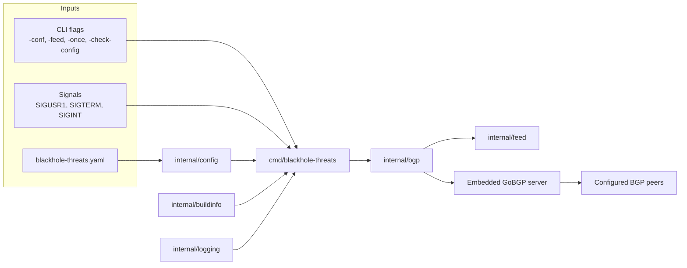
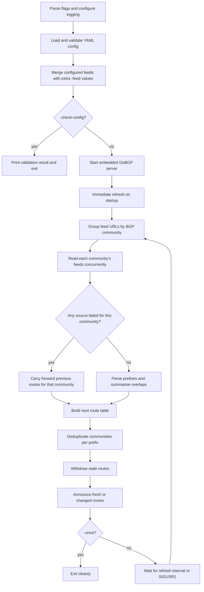

# Architecture

`blackhole-threats` is a single-purpose Go daemon that turns external threat
feeds into controlled BGP blackhole announcements. The codebase is intentionally
small: configuration loading, feed ingestion, route-table calculation, and BGP
publication are kept in separate internal packages, while packaging and website
assets stay outside the runtime path.

See also:

- [Documentation Index](README.md)
- [Operations Guide](operations.md)
- [Feed Behavior](feed-behavior.md)
- [Release And Publishing](release-and-publishing.md)

## System Overview

At a high level, the daemon:

1. Loads and validates operator-supplied YAML.
2. Merges configured feeds with any extra `-feed` CLI arguments.
3. Starts an embedded GoBGP server.
4. Builds the desired route table from configured threat feeds.
5. Withdraws stale routes and announces fresh or changed routes.
6. Repeats on a timer, or immediately when sent `SIGUSR1`.

## Repository Layout

| Path | Responsibility |
| --- | --- |
| `cmd/blackhole-threats` | Process entrypoint, flag parsing, startup, signal wiring, and shutdown handling |
| `internal/buildinfo` | Version, commit, and build-date metadata injected by builds and CI |
| `internal/config` | YAML decoding, config validation, feed definitions, and BGP community parsing |
| `internal/feed` | Local/remote feed retrieval, text and JSON parsing, and prefix summarisation |
| `internal/bgp` | GoBGP lifecycle, route-table construction, diffing, and announce/withdraw orchestration |
| `internal/logging` | Operator-friendly logfmt output, JSON logging, and GoBGP logger integration |
| `examples/` | Reference configuration for operators and smoke tests |
| `packaging/container/` | Container rootfs, entrypoint helpers, and S6 service definitions |
| `debian/` | Debian package metadata and maintainer scripts |
| `.github/assets/website/` | Vite-based GitHub Pages site that fronts the signed APT repository |

## Runtime Lifecycle

The runtime loop is deliberately conservative: the daemon computes the desired
route state first, then reconciles the live BGP table against that desired
state.

### Entry Point Behaviour

`cmd/blackhole-threats/main.go` owns the process lifecycle:

- selects the log formatter and log level
- loads the config file and validates both the BGP config and feed list
- supports `-check-config` as a validation-only path
- supports `-once` as a single refresh-cycle path
- installs `SIGUSR1` for immediate refresh
- installs `SIGINT` / `SIGTERM` for graceful shutdown

Startup logs also include build metadata such as tag version, commit, build
date, Go runtime version, and process ID.

## Route Table Construction

The most important runtime behaviour lives in `internal/bgp/server.go`.

### Community-first grouping

Feeds are grouped by BGP community before they are fetched. If a feed does not
declare a community, the daemon assigns the default community
`<local ASN>:666`.

This means the daemon treats each community as a refresh unit:

- all sources mapped to the same community are read together
- a successful community refresh produces a fresh set of summarised prefixes
- a failed community refresh carries forward the previous routes for that
  community instead of partially replacing them

### Prefix ownership model

Internally, the desired route table is stored as a map keyed by prefix string.
Each prefix keeps:

- the canonical parsed prefix
- the list of attached BGP communities

This lets one prefix be advertised with multiple communities when different
feeds converge on the same network. Before publication, communities are sorted
and deduplicated so route comparisons remain stable between refreshes.

### Reconciliation model

Once the next route table is prepared, the daemon compares it against the
currently active route table:

- unchanged prefix/community combinations are left alone
- routes that disappeared, or whose community set changed, are withdrawn
- new routes, or routes whose community set changed, are announced

That reconciliation model keeps update churn lower than replaying every route on
each cycle.

## Feed Ingestion Model

`internal/feed` is responsible for reading and normalising threat data.

Supported source types:

- local files
- `http://` URLs
- `https://` URLs

Supported feed formats:

- plain text with embedded prefixes
- JSON arrays
- JSON streams such as JSONL and NDJSON

The feed reader:

- fetches sources concurrently within each community batch
- extracts IPv4 and IPv6 prefixes
- ignores non-prefix noise
- summarises overlapping networks before handing results to the BGP layer

## Failure Handling

The daemon prefers to preserve the last known-good state rather than withdraw on
uncertain input.

Important failure semantics:

- invalid YAML, router IDs, or unsupported feed schemes fail fast at startup
- non-OK HTTP responses and parsing failures are logged as feed errors
- if any source fails inside a community batch, the previous routes for that
  community are carried forward for the current cycle
- refreshes continue on the next timer tick or `SIGUSR1`

This makes community assignment an important operational boundary: feeds that
must fail independently should not be grouped under the same community unless
that shared fallback behaviour is desired.

## Logging and Observability

`internal/logging` provides two runtime formats:

- `logfmt` via the custom operator formatter
- JSON via Logrus' JSON formatter

The default operator formatter keeps logs readable in Docker, journald, and
syslog pipelines while still carrying structured fields such as:

- `tag_version`
- `commit`
- `build_date`
- `local_as`
- `router_id`
- `peer_count`
- `configured_feeds`
- `announced`
- `withdrawn`
- `duration_ms`

The embedded GoBGP server is also wired through the same logger so application
and GoBGP events share the same output style.

## Design Goals

- Keep the operator-facing workflow simple and auditable.
- Keep runtime packages small and sharply scoped.
- Prefer deterministic route diffs over replay-style updates.
- Preserve last known-good community state when upstream feeds fail.
- Keep build, packaging, and GitHub Pages publication first-party and visible in
  the repository.
